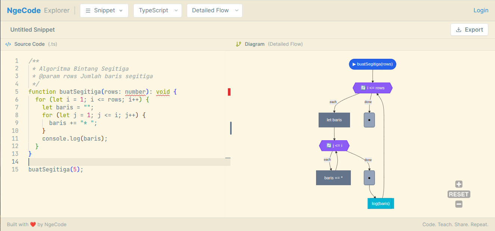

Halo semuanya, selamat datang di blog pribadi saya!

Sebagai seorang Software Engineer, saya sering kali merasa ada banyak hal yang jika didokumentasikan mungkin bisa berguna, tidak hanya untuk saya pribadi tapi juga untuk orang lain. Itulah salah satu alasan saya membangun website ini.

Untuk artikel pertama, saya ingin menceritakan sedikit tentang proses *behind the scenes* dari salah satu proyek kebanggaan saya saat ini: **[ngeCode.id](https://ngecode.id)**.

## Apa itu ngeCode.id?

Jika Anda mengunjungi webnya, Anda akan melihat deskripsi singkat: *Converter Code to Diagram*.

Singkatnya, **ngeCode** adalah sebuah *tool* yang mengambil input berupa teks (source code/syntax) dan secara otomatis merendernya menjadi visual berbentuk diagram berstruktur (seperti Flowchart). 

## Mengapa Membuatnya?

Setiap kali seseorang belajar koding, terutama di awal-awal (saat berhadapan dengan algoritma, *looping*, dan *conditional logic*), membaca baris kode mentah terkadang sangat mengintimidasi.

Banyak pemula kebingungan, *"Ini kalau kode nge-loop, alur mikirnya baliknya ke mana ya?"* atau *"Bagian if-else ini cabangnya lari ke fungsi yang mana?"*

*Tools* yang ada di pasaran kebanyakan mengharuskan penggunanya menggambar kotak dan menarik garis secara manual (seperti *draw.io* atau *Lucidchart*). Padahal, apa yang dicari oleh programmer atau instruktur adalah sesuatu yang instan: **Punya kode \-\> Langsung jadi diagram alurnya**.

Itulah masalah yang coba saya pecahkan lewat **ngeCode**. Begini kira-kira hasil dari proses *convert* kode (teks) menjadi visual menggunakan aplikasi ini:

*Contoh render diagram flowchart interaktif menggunakan ngeCode.id*

## Tantangan di Balik Layar

Membangun aplikasi yang membaca *source code* lalu diubah jadi visual itu menantang. Untuk proyek ini, saya menggunakan fondasi *framework* kustom yang sangat cepat, yang saya beri nama **Laju**. Sesuai namanya, Laju dirancang untuk *high-performance* dengan tumpukan teknologi berikut:

1. **HyperExpress (Backend):** Saya tidak menggunakan Express.js biasa, melainkan HyperExpress yang dibangun di atas *uWebSockets.js*. Kecepatannya sangat luar biasa untuk merelasikan *client* dan *server*. Terlebih dengan integrasi **Yjs** dan **y-websocket**, *real-time collaboration* jadi sangat mulus.
2. **Svelte 5 & Inertia.js (Frontend):** Svelte 5 memberikan *reactivity* murni tanpa *Virtual DOM* yang berat, sangat pas untuk men-*handle* kanvas diagram. Dipadukan dengan *Inertia.js*, perpindahan antar halamannya terasa secepat SPA (*Single Page Application*) tapi *routing*-nya tetap dipegang dari sisi server.
3. **Alat Inti & Parser (Core Tools):** Inilah jantung dari ngeCode! Proses *converter*-nya melibatkan langkah rumit:
    - **@babel/parser:** Digunakan untuk memecah/mem-*parsing* *source code* JavaScript atau TypeScript yang diinputkan pengguna dan menerjemahkannya menjadi himpunan struktur *Abstract Syntax Tree* (AST).
    - **Mermaid.js:** Mengambil data hasil AST dari Babel tadi, lalu dikalkulasi koordinat *node*-nya untuk kemudian dirender dari sisi *backend* menjadi diagram flowchart yang akurat.
    - **Monaco Editor & SVG Pan-Zoom:** Monaco dipakai sebagai *code editor browser* (serupa mesin VS Code), sementara SVG Pan-Zoom ditugaskan agar diagram algoritma yang sekompleks apapun tetap bisa dikendalikan (di-*zoom* & di-*pan*) tanpa pecah.

## Penutup

Sampai saat ini, melihat ada sebuah *tool* buatan sendiri yang diluncurkan dan bisa dipakai langsung oleh *user*—terutama membantu pemula memahami algoritma—memberikan kepuasan batin tersendiri bagi seorang *engineer*.

Kalau Anda butuh pemetaan mental dari kode yang sedang Anda atau murid-murid Anda pelajari, silakan coba pakai [ngeCode.id](https://ngecode.id).

Terima kasih sudah membaca tulisan pertama ini. Sampai jumpa di jurnal teknis berikutnya!
