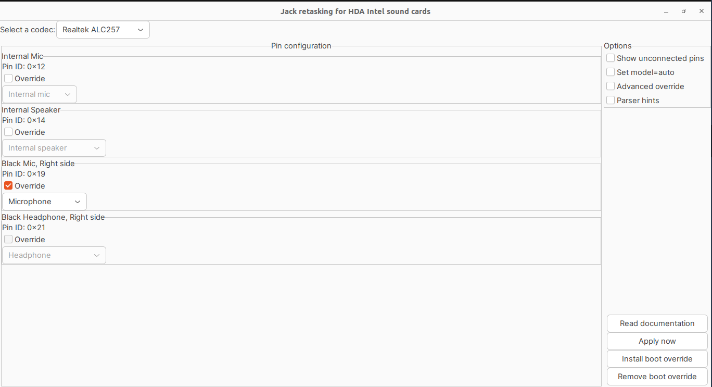

Pernahkah kamu mengalami kejadian saat mencolokkan headset (jack audio 3.5mm combo) ke laptop dengan OS Ubuntu 22.04, suara *output* (speaker/earphone) sukses berpindah ke headset, tetapi mikrofon inputnya malah **tetap menggunakan mic internal laptop**?

Masalah ini cukup umum terjadi di berbagai laptop (terutama dengan sound card Realtek seperti ALC257 pada ThinkPad atau seri laptop lainnya). Sistem Linux sering kali gagal mengenali *pin switching* otomatis pada combo audio jack, sehingga pin mikrofon eksternal tidak aktif secara default.

Kabar baiknya, masalah ini bisa diselesaikan secara permanen tanpa perlu kompilasi ulang kernel, yaitu dengan melakukan **jack retasking** menggunakan tool bawaan ALSA bernama **`hdajackretask`**.

---

## 1. Penyebab Masalah

Pada laptop modern, lubang jack 3.5mm biasanya bertipe *combo jack* (TRRS) yang menggabungkan jalur audio output (headphone) dan audio input (microphone) dalam satu colokan.

Di Linux, driver audio Intel HDA / Realtek terkadang tidak mengonfigurasi pin routing mikrofon pada jack fisik tersebut dengan benar. Akibatnya:
- Sistem mendeteksi colokan headphone (output normal).
- Namun pin jalur mikrofon headset diabaikan dan input tetap terkunci pada *Internal Mic*.

Solusinya adalah me-remap (override) pin hardware yang terhubung ke jack 3.5mm agar dikenali sebagai input **Microphone**.

---

## 2. Instalasi Tool ALSA Jack Retask

Tool `hdajackretask` merupakan bagian dari paket `alsa-tools-gui`. Kita bisa menginstalnya langsung lewat terminal:

```bash
sudo apt update
sudo apt install alsa-tools-gui -y
```

Setelah proses instalasi selesai, jalankan aplikasinya:

```bash
hdajackretask
```

*(Atau buka menu aplikasi di Ubuntu dan cari "HDAJackRetask").*

---

## 3. Langkah Konfigurasi (Override Pin)

Berikut langkah demi langkah konfigurasi di dalam antarmuka `hdajackretask`:



1. **Pilih Codec Audio:**  
   Pada dropdown **Select a codec** di pojok kiri atas, pilih sound card utama laptop kamu (misalnya: `Realtek ALC257` atau codec ALC lainnya).
2. **Cari Pin Mikrofon Headset:**  
   Pada daftar **Pin configuration**, cari bagian:
   - **Black Mic, Right side** (dengan **Pin ID: `0x19`** atau pin yang mewakili jack 3.5mm samping).
3. **Aktifkan Override:**  
   Centang kotak **Override** pada pin tersebut.
4. **Ubah Target Menjadi Microphone:**  
   Pada dropdown di bawahnya, pilih **Microphone**.
5. **Uji Coba Langsung:**  
   Klik tombol **"Apply now"** di kanan bawah. Coba colokkan headset kamu, lalu buka *Settings > Sound* atau buka aplikasi perekam suara. Bicara melalui mic headset dan pastikan level bar input merespons suara dari headset kamu.
6. **Pasang Permanen Saat Booting:**  
   Jika suara mic headset sudah masuk dan normal, klik tombol **"Install boot override"**. Masukkan password `sudo` kamu saat diminta.

> [!NOTE]
> Menekan tombol **Install boot override** akan membuat rule firmware khusus di sistem sehingga konfigurasi pin ini akan otomatis aktif setiap kali laptop dinyalakan kembali (*persistent reboot*).

---

## 4. Verifikasi dan Pengujian

Untuk memastikan mikrofon headset sudah benar-benar aktif dan bekerja:

1. Buka **Settings** → **Sound** di Ubuntu.
2. Pada bagian **Input Device**, periksa apakah terdapat pilihan mikrofon eksternal / headset.
3. Lakukan pengetesan dengan berbicara langsung dekat mikrofon headset. Jika indikator volume bergerak naik-turun sesuai suara headset (bukan suara ketukan di bodi laptop), berarti routing telah berhasil 100%.

Jika kamu menggunakan aplikasi kontrol audio seperti **Pavucontrol**:
```bash
pavucontrol
```
Buka tab **Input Devices**, pastikan port yang terpilih adalah *Headset Microphone* atau *Microphone*.

---

## 5. Cara Mengembalikan ke Default (Rollback)

Jika di kemudian hari kamu ingin membatalkan perubahan atau mencoba konfigurasi lain:

1. Buka kembali aplikasi `hdajackretask`.
2. Pilih codec yang sama.
3. Klik tombol **"Remove boot override"** di pojok kanan bawah.
4. Masukkan password sudo dan lakukan restart laptop.

---

## Kesimpulan

Masalah headset mic yang tidak terdeteksi di Ubuntu 22.04 biasanya hanyalah masalah pemetaan pin audio ALSA yang belum tepat. Dengan bantuan GUI `hdajackretask`, kita bisa mengalihkan (*retask*) fungsi pin hardware `0x19` secara presisi dan menyimpannya secara permanen saat boot.
